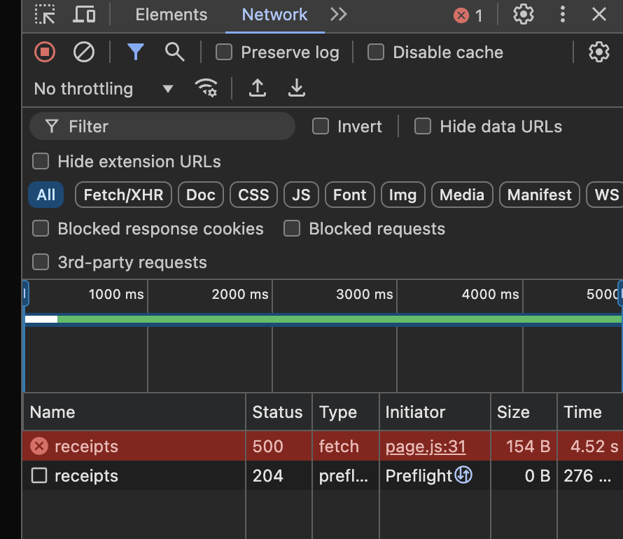
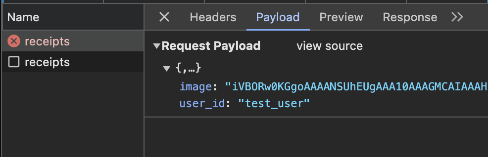

# The Backend Dev Log

The full plan for the website was to have a nice website UI and a simple image uploading/storing function powered by Terraform. After some login issues with Azure, the chosen cloud provider was AWS. 

Event driven infrastructure provides the developer with AWS resources and hosting without having to worry about runtime, operating servers, and bandwidth issues. AWS Lambda in particular was create off of this idea; it runs code in response to certain "events," and it is priced by request.

There were a few ways to achieve connection between a user and an S3 bucket. But in general, a frontend will hold access to an API endpoint that connects it to the server. After sending a request through the API, a Lambda function will capture it and run some code based on the event and context. 

A popular method online involved "pre-signed" urls, where the lambda function would call for a signed url to the S3 bucket, allowing for quick and direct file transfers later on. However, we opted to not use the urls, mostly because we thought it was doable by sending JSON dumps. 


We first experienced what appeared to be network errors, as the front-end for testing was jank. We frequently used the inspector tool to view what statuses were occuring (403, 500, 200) for every request. An imported library "axios" wasn't able to fetch from the server, but we later realized it was all server-side errors. The Cross-Origin Resource Sharing (CORS) configuration was not applying correctly, but this was due to bad architecture: The Lambda function was expecting an event from the S3 buckets changing, when we wanted it to trigger on GET/POST requests. 




Once we changed how the requests were routed, we attempted to test with Postman (a simple website that allows users to easily build and test API). Basically, you put in the gateway API url and the key ("/receipts"), the type of request you want to send, and send it. Here is an example of a POST request being approved:


(Body is null because there was no image being sent through this)

There were many bugs. We caught a few, such as the output not matching the 1.0 event format (but 2.0 worked). While testing the lambda script, it would correctly output to the API. But since the format was incorrect, the gateway would throw its own error, causing every error to be 500. Digging down into the infrastructure to see where the error was coming from took hours. This project truly emphasized the need for good testing habits; build a little and test, don't dump all the code out at once and pray that it works.

It is easy for beginners to misunderstand Terraform as a tool. I thought of it as similar to what ~/.ssh/config does to enable repeatable ssh connections later on-- it templates all the settings a Cloud service requires so that deployment can be done in one line. For a beginner hackathon project, using it was not entirely necessary because the scope of our project was not large, but it definitely has its uses even for smaller projects. In our case, Terraform was responsible for all the AWS resource management, uploading the Python Lambda script, displaying the API, creating new IAM users for the lambda, and more. 

Serverless Land is a resource lent to the public by AWS developers that I encourage people to check out if they want to see how Terraform can be fully utilized. They have dozens of patterns for different web services can be simply cloned and deployed in two clicks. No worries about the overhead. 

Below is a snippet from a pattern that sets up a Amazon API Gateway HTTP API integrated with a Python Lambda function and basic CORS configuration. Manually, you would have to go into the AWS console and search for a bucket to apply the configurations on, but it was made simple using Terraform. 


```
resource "aws_apigatewayv2_api" "lambda" {
  name          = "apigw-http-lambda"
  protocol_type = "HTTP"
  description   = "Serverlessland API Gwy HTTP API and AWS Lambda function"

  cors_configuration {
      allow_credentials = false
      allow_headers     = []
      allow_methods     = [
          "GET",
          "HEAD",
          "OPTIONS",
          "POST",
      ]
      allow_origins     = [
          "*",
      ]
      expose_headers    = []
      max_age           = 0
  }
}

```


### TLDR: Came here for fun, accidentally ended up learning AWS

```
terraform {
  required_providers {
    aws = {
      source  = "hashicorp/aws"
      version = "~> 4.16"
    }
  }

  required_version = ">= 1.2.0"
}

provider "aws" {
  region = "us-west-2"
}

# S3 bucket
resource "aws_s3_bucket" "receipt_storage" {
  bucket = "receipt-storage-${var.environment}"
}

# versioning on the bucket
resource "aws_s3_bucket_versioning" "receipt_storage_versioning" {
  bucket = aws_s3_bucket.receipt_storage.id
  versioning_configuration {
    status = "Enabled"
  }
}

# encryption for the bucket
resource "aws_s3_bucket_server_side_encryption_configuration" "receipt_storage_encryption" {
  bucket = aws_s3_bucket.receipt_storage.id
  rule {
    apply_server_side_encryption_by_default {
      sse_algorithm = "AES256"
    }
  }
}

# DynamoDB table for metadata
resource "aws_dynamodb_table" "receipt_metadata" {
  name           = "receipt-metadata-${var.environment}"
  billing_mode   = "PAY_PER_REQUEST"
  hash_key       = "receipt_id"
  
  attribute {
    name = "receipt_id"
    type = "S"
  }

  attribute {
    name = "user_id"
    type = "S"
  }

  global_secondary_index {
    name               = "UserIdIndex"
    hash_key           = "user_id"
    projection_type    = "ALL"
  }
}

# lambda 
resource "aws_lambda_function" "receipt_processor" {
  filename         = "receipt_processor.zip"
  function_name    = "receipt-processor-${var.environment}"
  role            = aws_iam_role.lambda_role.arn
  handler         = "index.handler"
  runtime         = "python3.9"

  environment {
    variables = {
      RECEIPT_BUCKET = aws_s3_bucket.receipt_storage.id
      METADATA_TABLE = aws_dynamodb_table.receipt_metadata.id
    }
  }
}

# API Gateway
resource "aws_apigatewayv2_api" "receipt_api" {
  
  name          = "receipt-api-${var.environment}"
  protocol_type = "HTTP"

  cors_configuration {
    allow_headers = ["*"]
    allow_methods = ["POST", "GET", "OPTIONS"]
    allow_origins = ["*"]  
    max_age      = 300
  }
}

resource "aws_apigatewayv2_stage" "receipt_api" {
  api_id = aws_apigatewayv2_api.receipt_api.id
  name   = "$default"
  auto_deploy = true
}

resource "aws_apigatewayv2_integration" "receipt_api" {
  api_id           = aws_apigatewayv2_api.receipt_api.id
  integration_type = "AWS_PROXY"
  integration_uri  = aws_lambda_function.receipt_processor.invoke_arn
  integration_method = "POST"
}

# IAM role for Lambda
resource "aws_iam_role" "lambda_role" {
  name = "receipt-processor-role-${var.environment}"

  assume_role_policy = jsonencode({
    Version = "2012-10-17"
    Statement = [
      {
        Action = "sts:AssumeRole"
        Effect = "Allow"
        Principal = {
          Service = "lambda.amazonaws.com"
        }
      }
    ]
  })
}

# IAM policy for Lambda to access S3 and DynamoDB
resource "aws_iam_role_policy" "lambda_policy" {
  name = "receipt-processor-policy"
  role = aws_iam_role.lambda_role.id

  policy = jsonencode({
    Version = "2012-10-17"
    Statement = [
      {
        Effect = "Allow"
        Action = [
          "s3:PutObject",
          "s3:GetObject",
          "s3:ListBucket"
        ]
        Resource = [
          aws_s3_bucket.receipt_storage.arn,
          "${aws_s3_bucket.receipt_storage.arn}/*"
        ]
      },
      {
        Effect = "Allow"
        Action = [
          "dynamodb:PutItem",
          "dynamodb:GetItem",
          "dynamodb:Query"
        ]
        Resource = [
          aws_dynamodb_table.receipt_metadata.arn,
          "${aws_dynamodb_table.receipt_metadata.arn}/index/*"
        ]
      },
      {
        Effect = "Allow"
        Action = [
          "textract:AnalyzeDocument"
        ]
        Resource = "*"
      }
    ]
  })
}


# Add routes for the API
resource "aws_apigatewayv2_route" "upload_route" {
  api_id    = aws_apigatewayv2_api.receipt_api.id
  route_key = "POST /receipts"
  target    = "integrations/${aws_apigatewayv2_integration.receipt_api.id}"
}

resource "aws_apigatewayv2_route" "get_route" {
  api_id    = aws_apigatewayv2_api.receipt_api.id
  route_key = "GET /receipts"
  target    = "integrations/${aws_apigatewayv2_integration.receipt_api.id}"
}


# Variables
variable "environment" {
  description = "Environment name (e.g., dev, prod)"
  type        = string
}

variable "aws_region" {
  description = "us-west-2"
  type        = string
}

# Outputs
output "api_endpoint" {
  value = aws_apigatewayv2_api.receipt_api.api_endpoint
}

output "bucket_name" {
  value = aws_s3_bucket.receipt_storage.id
}


```